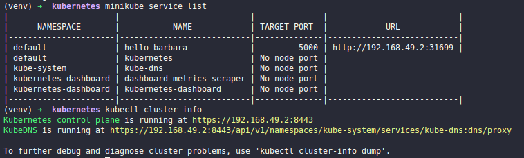

## Run application python with Minikube

### Install:
    - pip
    - python
    - docker
    - flask
    - minikube

### To run application python:
```python application.py```

### To run application python with Docker:
```docker build -t <user_docker_hub>/hello-barbara-1 .```

```docker run --rm -it -p 5000:5000 <user_docker_hub>/hello-barbara-1:latest```

### Open browser and access application
```http://0.0.0.0:5000/app``` 

### To push image docker to Docker Hub:
```docker login```

```docker push <user_docker_hub>/hello-barbara-1:latest```

### To run application python in Kubernetes (Minikube):
```minikube start```

```minikube dashboard```

### Enter in folder k8s-files and create pod.yml, deployment.yml and service.yml
```kubectl create -f pod.yml```

```kubectl create -f deployment.yml```

```kubectl create -f service.yml```

### You could run the commands next to verify if pod, deployment and service was running

- To verify pods was running:

```kubectl get po```

- To verify deployments was running:

```kubectl get deploy```

- To verify service was running:

```kubectl get svc```

### Verify information of cluster for run application in browser

```kubectl cluster-info```

```minikube service list```

### Open browser and access application

- Get IP address where Kubernetes master is running
- Get port where the service port is mapped

```http://<ip_address>:<port>/app```

